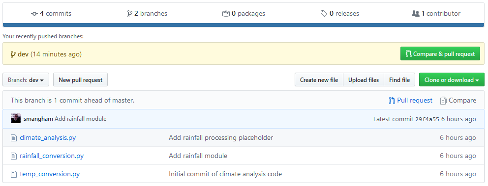
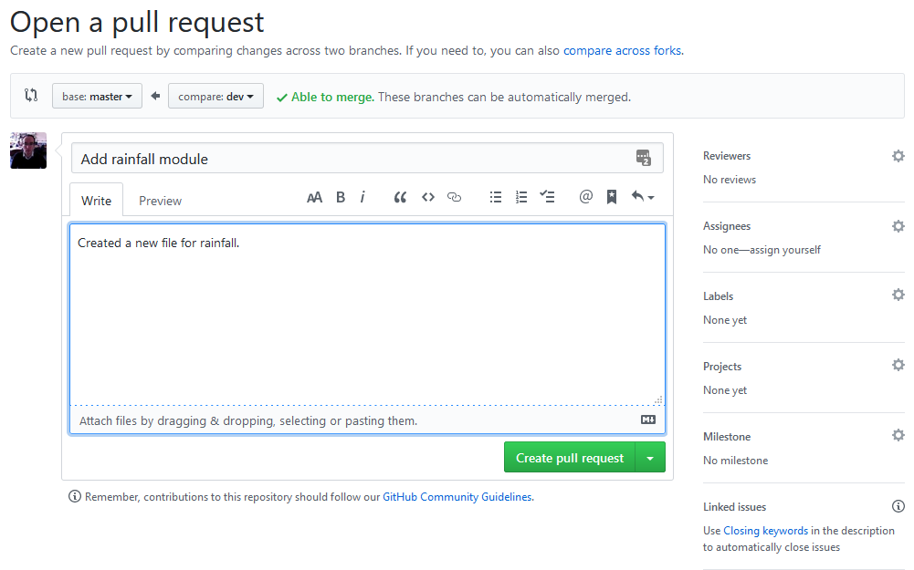

> ## Learning Objectives {.objectives}
>
> *   Explain what remote repositories are and why they are useful.
> *   Explain what branches are and why they are useful.
> *   Show how work collaboratively on a remote repository using branches.

So far, we've seen how Version control can help us **track the changes** we make to our files, and to **revisit** any point in their history.

(there are a few extra commands we haven't covered today for you to look at).

But, version control really comes into its own
when we begin to **collaborate** with other people.

###The missing link###
We already have most of the machinery we need to do this;
the only thing missing is to copy changes from one repository to another.

Systems like Git allow us to **synchronise** work between any two repositories.

In practice,
though, it's easiest to use one copy as a **central hub**,
and to keep it on the web rather than on someone's laptop.

Many programmers use hosting services like **GitHub** or **BitBucket**
to hold those master copies;  we'll explore the pros and cons of these a bit later.  

### Exploring the collaborative process ###

But first let's explore the collaborative process.

So far we have been working in isolation.  We're going to use **GitHub** to set up a remote repository and start **"collaborating"** with others.

### To GitHub! ###

Let’s start by sharing the changes we’ve made to our current project with the world. **Log in to GitHub**, then click on the button in the left-hand panel to create a **new repository** called `climate-analysis`:

(You can also click on the 'plus' icon in the top-right and select **New Repository** too)

**Name your repository** "climate-analysis" 
You can optionally give it a friendly **description** and prove a **README.md** which is rendered on the front page of the web interface.

GitHub will host **Publicly** accessible repositories **free** of charge, but makes a charge for Private ones. 
However, researchers can apply for a [free GitHub Pro update](https://help.github.com/en/github/teaching-and-learning-with-github-education/applying-for-an-educator-or-researcher-discount) via GitHub Education, which will allow you free unlimited private repositories.
**BitBucket** offers free private repositories for teams of up to 5.  

You need to be sure that you **really want to make your code publicly accessible**, think about **licensing**, and that you're not **breaching the terms of any license** of shared code by making it publicly available.

and then click **"Create Repository"**:

###Connecting the remote repository###

Our **local** repository still contains our earlier work on `climate-analysis.py` and `temp_conversion.py`,
but the **remote** repository on GitHub doesn't contain any files yet:

The next step is to **connect** the two repositories.

We do this by making the GitHub repository a **[remote](reference.html#remote)**
for the local repository.  A **remote** is a repository conected to another in such way that both can be kept **in sync** exchanging commits.

The home page of the repository on GitHub includes
the string we need to identify it:

Copy that URL from the browser,
go back to your local repository,
and run this command **using your repository name** not mine:

~~~ {.bash}
$ git remote add origin https://github.com/js-robinson/climate-analysis.git
~~~

The name `origin` is a **local nickname** for your **remote repository**:
we **could** use something else if we wanted to,
but `origin` is **conventional**, and will come in useful later.

The only difference should be your username instead of `js-robinson`.

We can check that the command has worked by running `git remote --verbose`:

~~~ {.bash}
$ git remote --verbose
~~~
~~~ {.output}
origin  https://github.com/js-robinson/climate-analysis.git (fetch)
origin  https://github.com/js-robinson/climate-analysis.git (push)
~~~

### Push commits from local to remote ###

Once the remote is set up, we can **push** the changes from our local repository
to the repository on GitHub:

~~~ {.bash}
$ git push origin master
~~~
~~~ {.output}
Counting objects: 10, done.
Delta compression using up to 8 threads.
Compressing objects: 100% (10/10), done.
Writing objects: 100% (10/10), 1.47 KiB | 0 bytes/s, done.
Total 10 (delta 2), reused 0 (delta 0)
To https://github.com/js-robinson/climate-analysis.git
 * [new branch]      master -> master
~~~
The push command takes two arguments, the **remote name** ('origin') and a **branch name** ('master').

We'll get to **branches** in a moment!

So, now, our local and remote repositories are now **in sync**! You can check in your browser that the files have reached your GitHub repository.

### Introducing branches ###

 Now we've shared our code with the world, and other people can download a copy of it- just like you downloaded a copy of the repository these lessons are in.

However, what happens if you want to keep working on it, adding new features to the code?

At the moment, there's only one version of the code available online. If keep making changes and pushing them to **GitHub**, then anyone who downloads from there will get all of our work in progress- whether or not it's ready to use!

Equally, we can't wait until we've finished all our work before **pushing** it to GitHub either. We could lose weeks or months of work if our computer breaks!

We can avoid this by using the **branches** we mentioned earlier.

A **branch** is a **different version** of the files in your repository, that can contain its own set of **commits**. We can create a new branch, make changes to the code that we commit to the branch, and when we're happy with those changes, merge them back to the main (‘master’) branch. Branches are commonly used as part of a **feature-branch workflow**: 

In this workflow, we have a main (`master`) branch which is the version of our code that's test and reliable, and want to share- for example, the version of the code we used in a paper. 
When sharing code used in a paper, you can mention the specific commit that you used!

Then, we have a development (`dev`) branch that we use for work-in-progress code.
As we work on adding new features to the code, we commit the changes to our development branch.

(We'll talk about feature branches later!)

### Creating branches ###

Let's **create a development branch** to work on:

~~~ {.bash}
git branch dev
~~~

This command doesn't give any output, but if we run `git branch` again, without giving it a new branch name, we can see the list of branches we have- including the new one we just made.

~~~ {.bash}
git branch
~~~
~~~ {.output}
  dev
* master
~~~

So how do we **switch** to this new branch? We use `git checkout` again, but this time with the name of the branch instead of the name of a file:

~~~ {.bash}
git checkout dev
~~~
~~~ {.output}
Switched to branch 'dev'
~~~

> ## Uncommitted changes & branches {.callout}
>
> If we try and check out a new branch whilst we have changed but not committed** any tracked files, then we'll get an error message!
> To fix this, make sure you commit your work before trying to check out a new branch. Make sure to give it a descriptive commit message for when you go back to it!

### Committing to branches ###

Now we've created a `dev` branch, we can start working on it without affecting our `master` branch.

Lets expand our library of climate analysis functions by adding a **new file**:

~~~ {.bash}
nano rainfall conversion.py
cat rainfall_conversion.py
~~~
~~~ {.output}
""" A library to perform rainfall unit conversions """

def inches_to_mm(inches):
    """
    Convert inches to milimetres.

    Arguments:
    inches -- the rainfall inches
    """
    mm = inches * 25.4
    return mm
~~~
~~~ {.bash}
git add rainfall_conversion.py
git commit -m 'Add rainfall module'
~~~
~~~ {.output}
[dev 29f4a55] Add rainfall module
 1 file changed, 10 insertions(+)
 create mode 100644 rainfall_conversion.py
~~~

You might have noticed a change already. 
The commit message now reminds us we're **committing to the `dev` branch**.

Now, if we check the history, we can see this commit was added:

~~~ {.bash}
git log
~~~
~~~ {.output}
commit 29f4a552f33bc4f26810c86b7cf7fafd2173034d (HEAD -> dev)
Author: Sam Mangham <mangham@gmail.com>
Date:   Tue Apr 28 13:42:23 2020 +0100
  
    Add rainfall module
      
commit 5a1a72a418b4b13f7f783d2feae755de7a24580c (origin/master, master)
Author: Sam Mangham <mangham@gmail.com>
Date:   Tue Apr 28 13:22:17 2020 +0100

    Add rainfall processing placeholder
    
commit 86bca165b4a1fb7028efbd88bd143deaced3ef9a
Author: Sam Mangham <mangham@gmail.com>
Date:   Tue Apr 28 13:21:30 2020 +0100

    Add Docstring
    
commit 736c5eaf3219ae81b126534424bfd27604d2406b
Author: Sam Mangham <mangham@gmail.com>
Date:   Tue Apr 28 13:17:43 2020 +0100

    Initial commit of climate analysis code
  
~~~

We can see the new commit to the `dev` branch in the **log**.
Helpfully, the history also shows the point at which our new `dev` branch broke away from the `master` branch.

Let's switch back to the `master` branch and look at the directory again:

~~~ {.bash}
git checkout master
~~~
~~~ {.output}
Switched to branch 'master'
~~~
~~~ {.bash}
ls
~~~
~~~ {.output}
climate_analysis.py  temp_conversion.py
~~~

We can see that the `rainfall_conversion.py` file we created on the `dev` branch has disappeared. However, if you check out `dev` again, it'll reappear:

~~~ {.bash}
git checkout dev
~~~
~~~ {.output}
Switched to branch 'dev'
~~~
~~~ {.bash}
ls
~~~
~~~ {.output}
climate_analysis.py  rainfall_conversion.py  temp_conversion.py
~~~

### Pushing & updating branches ###

Now we have a commit to our `dev` branch, how do we get the changes from it into our `master` branch? There's a couple of ways of doing this, but we're going to do it using a **pull request on GitHub**.

First, we'll push the contents of the `dev` branch to GitHub the same way as we pushed the `master` branch:

~~~ {.bash}
git push origin dev
~~~
~~~ {.output}
Counting objects: 3, done.
Delta compression using up to 4 threads.
Compressing objects: 100% (3/3), done.
Writing objects: 100% (3/3), 467 bytes | 233.00 KiB/s, done.
Total 3 (delta 0), reused 0 (delta 0)
remote:
remote: Create a pull request for 'dev' on GitHub by visiting:
remote:      https://github.com/smangham/climate-analysis/pull/new/dev
remote:
To https://github.com/smangham/climate-analysis
 * [new branch]      dev -> dev
~~~

Now our `dev` branch is on GitHub! Let's go and check it out. 
Just above the list of files on the left-hand side is a dropdown labelled 'branches'. Select `dev`, and you should see the list of files change:

At the top of the list of files, a notification tells you that this branch has more commits in it than the `master` branch. If we want to see what the difference is, and **merge the changes** from `dev` to `master`, we need to make a **pull request**.

A **pull request** is a formal way to request to merge the changes from one branch into another, providing a message letting people know what your changes do. GitHub provides you with a range of tools to help manage pull requests.

If you're part of a team, you can suggest **reviewers** for your code, just as you'd recommend reviewers for a paper. Getting extra eyes on your code can help spot any bugs or mistakes early on.

In addition, you can **assign** the pull request to someone. They'll be notified that they've been assigned. 
This can be useful to assign complicated pull requests that can't be automatically merged to someone else!
  
Below this section of the **pull request**, you can see a list of changes this pull request would make. This is useful when reviewing code:

In this case, we can see one new file has been created.

Now, let's click **Create pull request**:

Fortunately, this branch can be **automatically merged**.
Not all branches can be automatically merged. For example, if you had made more commits straight to `master`, if they edited the same lines in the same files as commits in `dev` there would be a **merge conflict**. We'll cover those in a bit.

Now we can click **Merge pull request**, and then add a commit message and click **Confirm merge** to update `master`!

Now we've updated the ‘master’ branch on GitHub with our new work from the `dev` branch! All we need to do is to update our **local version**. Let's go back to our command line and check out the master branch, then **pull our changes** from GitHub to our computer:

~~~ {.bash}
git checkout master
~~~
~~~ {.output}
Switched to branch 'master'
~~~
~~~ {.bash}
git pull origin master
~~~
~~~ {.output}
remote: Enumerating objects: 1, done.
  remote: Counting objects: 100% (1/1), done. 
remote: Total 1 (delta 0), reused 0 (delta 0), pack-reused 0
Unpacking objects: 100% (1/1), done.
From https://github.com/smangham/climate-analysis
* branch            master     -> FETCH_HEAD
  5a1a72a..32fa979  master     -> origin/master
Updating 5a1a72a..32fa979
Fast-forward
  rainfall_conversion.py | 10 ++++++++++
  1 file changed, 10 insertions(+)
  create mode 100644 rainfall_conversion.py
~~~

Now we've merged the changes from our `dev` branch into our local `master` branch!

### Feature-branch workflows ###

Now we know how to keep a seperate working copy of our code, and use it to update the version we want other people to use.
But what if, whilst we're working on adding a new feature in our development branch, someone finds a bug in our code?
We don't want to have to complete the new feature in `dev` before we can start fixing the bug!

Plus, what if **multiple people** want to work on the code at once, each working on a new feature?
If they're all using `dev`, there'll be plenty of **merge conflicts**. Plus, it makes testing the effect of the new features much harder- we only want to change one thing at a time!

This is where the **feature-branch workflow** we mentioned comes in! Remember the figure from earlier?

There's a ‘master’ branch, a ‘development’ branch, but also several <strong>feature branches</strong>.

When you want to make some changes to the code, like adding new features (or even fixing a complicated bug), you <strong>create a new feature branch</strong>.
Then, you can work on your <strong>feature branch</strong> without worrying about conflicts or confusing others with work-in-progress files.

Once you've finished and tested your new work, 
then you can submit a <strong>pull request</strong> from your <strong>feature branch</strong> back to the <strong>`dev` branch</strong>.

In some collaborations, only some people have permission to <strong>merge pull requests</strong> to the `dev` and `master` branches.
This makes sure that nothing gets into the shared versions of the code without it being properly reviewed and tested by others!

> ## Exercise: Two way collaboration {.challenge}
> Now let's put the feature-branch workflow into practise!
> The code needs some documentation so people know what it does. Try creating a new branch coming off `dev` called `doc`, then add a new file called `README.md` containing the text “Tools to parse and convert climate data from CSV”.
> Once you've done that, add and commit the file to your local repository, then push your changes up to GitHub. Then once they're on GitHub, create a pull request, merge your new feature branch back into your development branch, and pull the changes to `dev` back to your local repository.

[Next - Conflicts](06-conflict.html)

