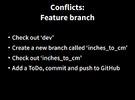
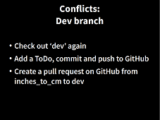
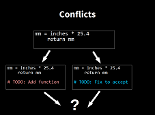
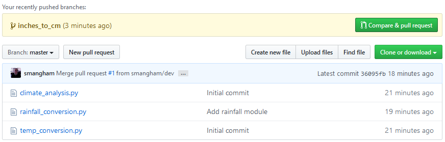
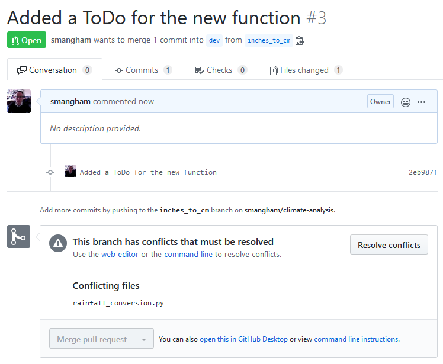
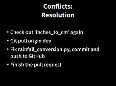
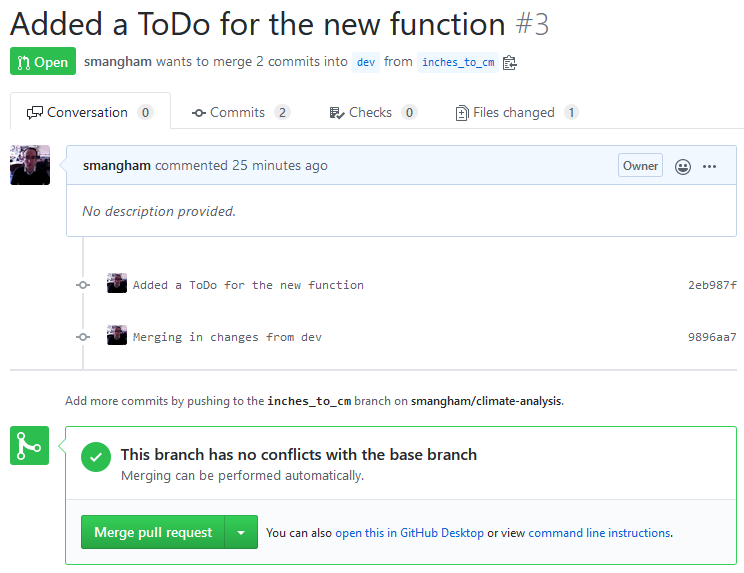

> ## Learning Objectives {.objectives}
>
> *   Explain what conflicts are and when they can occur.
> *   Resolve conflicts resulting from a merge.

As soon as people can work in **parallel**,
someone is going to step on someone else's toes.

This will even happen with a single person:
if we are working on a piece of software on both our laptop and a server in the lab,
we could make different changes to each copy.

These situations are called **conflicts**
Version control helps us manage these [conflicts](reference.html#conflicts)
by giving us tools to [resolve](reference.html#resolve) overlapping changes.

To see how we can resolve conflicts, we must first create one. 
We'll do this in the `rainfall_conversion.py` file- 
we'll edit it in two different branches, and try to merge them together.
The file `rainfall_conversion.py` currently looks like this in our repository:

~~~ {.bash}
$ cat rainfall_conversion.py
~~~
~~~ {.output}
"""A library to perform rainfall unit conversions"""

def inches_to_mm(inches):
    """Convert inches to milimetres.

    Arguments:
    inches -- the rainfall inches
    """
    mm = inches * 25.4
    return mm
~~~

### Feature branch - modify and push ###

Starting from the `dev` branch, let's create a new **feature branch**, 
check it out, then add a line to our copy of `rainfall_conversion.py`:

~~~ {.bash}
$ git checkout dev
~~~
~~~ {.output}
Switched to branch 'dev'
~~~
~~~ {.bash}
$ git branch inches_to_cm
$ git checkout inches_to_cm
~~~
~~~ {.output}
Switched to branch 'inches_to_cm'
~~~
~~~ {.bash}
$ nano rainfall_conversion.py
$ cat rainfall_conversion.py
~~~
~~~ {.output}
"""A library to perform rainfall unit conversions"""

def inches_to_mm(inches):
    """Convert inches to milimetres.

    Arguments:
    inches -- the rainfall inches
    """
    mm = inches * 25.4
    return mm

# TODO: Add function to convert from inches to centimetres
~~~

and then push the change to GitHub:

~~~ {.bash}
$ git add rainfall_conversion.py
$ git commit -m "Added a ToDo for the new function"
~~~
~~~ {.output}
[inches_to_cm 4d57c19] Added a ToDo for the new function
 1 file changed, 2 insertions(+)   
~~~
~~~ {.bash}
$ git push -u origin inches_to_cm
~~~
~~~ {.output}
Counting objects: 3, done.
Delta compression using up to 4 threads.
Compressing objects: 100% (3/3), done.
Writing objects: 100% (3/3), 359 bytes | 359.00 KiB/s, done.
Total 3 (delta 2), reused 0 (delta 0)
remote: Resolving deltas: 100% (2/2), completed with 2 local objects.
remote:
remote: Create a pull request for 'inches_to_cm' on GitHub by visiting:
remote:      https://github.com/smangham/climate-analysis/pull/new/inches_to_cm
remote:
To https://github.com/smangham/climate-analysis.git
 * [new branch]      inches_to_cm -> inches_to_cm
Branch 'inches_to_cm' set up to track remote branch 'inches_to_cm' from 'origin'.  
~~~

This time, we added a `-u` to `git push -u origin inches_to_cm`. This **sets the default remote branch**-
now in future, we can just use `git push` to send our updates.

### Dev branch - modify and push ###

Now, *before* we merge in our updated feature branch, let's make a change to the `dev` branch:

~~~ {.bash}
$ git checkout dev
~~~
~~~ {.output}
Switched to branch 'dev'
~~~
~~~ {.bash}
$ nano rainfall_conversion.py
$ cat rainfall_conversion.py
~~~
~~~ {.output}
"""A library to perform rainfall unit conversions"""

def inches_to_mm(inches):
    """Convert inches to milimetres.

    Arguments:
    inches -- the rainfall inches
    """
    mm = inches * 25.4
    return mm

# TODO: Fix to accept strings e.g. 6'
~~~

We can commit the change locally:

~~~ {.bash}
$ git add rainfall_conversion.py
$ git commit -m "Added a ToDo for a bug fix"
~~~
~~~ {.output}
[dev 35edcc1] Added a ToDo for a bug fix
 1 file changed, 2 insertions(+)   
~~~
~~~ {.bash}
$ git push -u origin dev
~~~
~~~ {.output}
Counting objects: 3, done.
Delta compression using up to 4 threads.
Compressing objects: 100% (3/3), done.
Writing objects: 100% (3/3), 337 bytes | 337.00 KiB/s, done.
Total 3 (delta 2), reused 0 (delta 0)
remote: Resolving deltas: 100% (2/2), completed with 2 local objects.
To https://github.com/smangham/climate-analysis.git
   7ef49c0..4e75bf0  dev -> dev
Branch 'dev' set up to track remote branch 'dev' from 'origin'.   
~~~

### GitHub - merging the changes ###

Now, let's try merging our work from the `inches_to_cm` branch into the `dev` branch,
just like we did with `doc`.

Git **detects** that the **changes** made in one copy **overlap** with those made in the other
and **stops us from trampling** on the work in the `dev` branch. 

We can create the pull request anyway. In order to complete it though, 
what we have to do is [merge](reference.html#merge) the changes from the `dev` branch into our feature branch,
and **then push** that.

You can do this on GitHub, but we're going to do it locally.

### Feature branch - pulling the changes ###

So now we need to merge the changes from `dev` into our featue branch, to get it up to date.

Let's check out `inches_to_cm` again:

~~~ {.bash}
$ git checkout inches_to_cm
~~~
~~~ {.output}
Switched to branch 'inches_to_cm'
~~~

We can do this by **pulling** the `dev` branch *into* the `inches_to_cm` branch:

~~~ {.bash}
$ git pull origin dev
~~~
~~~ {.output}
From https://github.com/smangham/climate-analysis
 * branch            dev        -> FETCH_HEAD
 Auto-merging rainfall_conversion.py 
 CONFLICT (content): Merge conflict in rainfall_conversion.py
 Automatic merge failed; fix conflicts and then commit the result.   
~~~

Git recognises that there's a conflict! Both branches have tried to edit the same line of `rainfall_conversion.py`.
It adds some markers to the file, so we can see where the conflict is:

~~~ {.bash}
$ cat rainfall_conversion.py
~~~
~~~ {.output}
""" A library to perform rainfall unit conversions """

def inches_to_mm(inches):
    """
    Convert inches to milimetres.
    Arguments:
    inches -- the rainfal inches
    """
    mm = inches * 25.4
    return mm

<<<<<<< HEAD
# TODO: Add function to convert from inches to cm
=======
# TODO: Fix to accept strings e.g. 6'
>>>>>>> 4e75bf05f7b8df642d7c34dc593e8548b4331f8c  
~~~

Our change&mdash;the one in `HEAD`&mdash;is preceded by `<<<<<<<`.
Git has then inserted `=======` as a separator between the conflicting changes
and marked the end of the content downloaded from GitHub with `>>>>>>>`.
(The string of letters and digits after that marker
identifies the revision we've just downloaded.)

It is now **up to us** to **edit** this file to **remove these markers**
and **reconcile the changes**.

We can do anything we want: **keep the change made in the local repository**, **keep
the change made in the remote repository**, write something new to **replace both**,
or **get rid of the change** entirely.

Let's **replace** both so that the file looks like this:

~~~ {.bash}
$ cat rainfall_conversion.py
~~~
~~~ {.output}
"""A library to perform rainfall unit conversions"""

def inches_to_mm(inches):
    """Convert inches to milimetres.

    Arguments:
    inches -- the rainfall inches
    """
    mm = inches * 25.4
    return mm

# TODO: Fix to accept strings e.g. 6', and add function to convert inches to cm
~~~

To finish merging, we add `rainfall_conversion.py` to the changes being made by the merge
and then commit:

~~~ {.bash}
$ git add rainfall_conversion.py
$ git status
~~~
~~~ {.output}
On branch inches_to_cm
Your branch is up to date with 'origin/inches_to_cm'.
All conflicts fixed but you are still merging.
   (use "git commit" to conclude merge)
Changes to be committed:

   modified:   rainfall_conversion.py   
~~~
~~~ {.bash}
$ git commit -m "Merging in changes from dev"
~~~
~~~ {.output}
[inches_to_cm 9896aa7] Merging in changes from dev 
~~~

Now we can push our changes to GitHub:

~~~ {.bash}
$ git push
~~~
~~~ {.output}
Counting objects: 3, done.
Delta compression using up to 4 threads.
Compressing objects: 100% (3/3), done.
Writing objects: 100% (3/3), 370 bytes | 370.00 KiB/s, done.
Total 3 (delta 2), reused 0 (delta 0)
remote: Resolving deltas: 100% (2/2), completed with 2 local objects.
To https://github.com/smangham/climate-analysis.git
   2eb987f..9896aa7  inches_to_cm -> inches_to_cm 
~~~

You can see that the pull request online has updated! (If it hasn't try refreshing the page)

Now we can automatically merge the changes from the `inches_to_cm` branch back into `dev`.

### Merge conflict solved ###

We've solved our merge conflict! Though this was a small and simple example, the process is 
the same even for more complicated ones with multiple conflicting lines in the same file- Git
will bundle up nearby changes into blocks you can easily compare.

<!-- 
> ## Reverse {.challenge}
> Now, Each add another line and Developer B push first.
> Developer A resolves the conflict
> Get yourselves back in sync

> ## Conflicts on Non-textual files {.challenge}
>
> What does Git do
> when there is a conflict in an image or some other non-textual file
> that is stored in version control? -->

###IF TIME###

[Ignoring Things](07-ignore.html)
